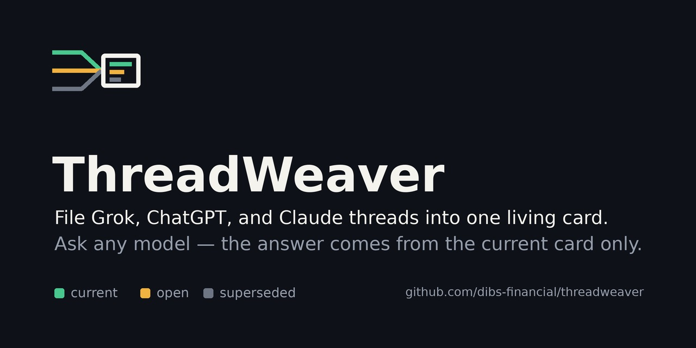

<p align="center">
  
</p>

# ThreadWeaver

**File Grok, ChatGPT, and Claude threads into one living card. Ask any model — the answer comes from the current card only.**

ThreadWeaver is a shared memory for people who decide across Grok, ChatGPT, Claude, Gemini, Perplexity, and RubyVox. You file the threads that matter. ThreadWeaver keeps one **Living State Card** per label and answers every model from that card, with a cite, instead of from whatever each chat window happens to remember.

---

## Why

Decisions get made in six chat windows. Each window remembers its own version. Two weeks later nobody can say which rule is live, which one was replaced, and where the replacement was written down.

ThreadWeaver fixes the source of truth, not the chatbot:

- **One card per label.** A label is a decision or a topic (`bond-rule`, `may-waterfall`, `pricing-v3`). The card holds what the team currently believes about it.
- **Three rails.** Every filed claim is `current`, `open`, or `superseded`. Default answers use `current` and `open` only. History is offered in one sentence and opened only on request.
- **A cite on every live claim.** Platform + date + thread title. Never a raw message id in anything a person reads or hears.
- **Vendor-blind.** The card does not care which model wrote the thread. Grok, ChatGPT, Claude, and Gemini all read the same card.

## How it works

```text
   Grok ──┐
ChatGPT ──┤   file this thread    ┌──────────────────────┐   continue / search_current   ┌────────────┐
 Claude ──┼──────────────────────►│  Living State Card   │──────────────────────────────►│ any model  │
 Gemini ──┤  (whole / from msg /  │  current · open ·    │   cited, current-only pack    │ or RubyVox │
RubyVox ──┘        this label)    │  superseded          │                               └────────────┘
                                  └──────────────────────┘
```

1. **File.** The only extra verb you learn is `file this thread` — whole, from this message, or under this label. Nothing is ingested unless you file it. Joining a group never vacuums your laptop or your private history.
2. **Weave.** ThreadWeaver places each claim on a rail. A newer rule supersedes an older one. Restatements of the same rule in two rooms are copies: the best wording wins and the other room gets a pointer, not a duplicate.
3. **Continue.** Any model with the ThreadWeaver tools (or a pasted card) answers from the pack: current + open, with cites. Conflicting current lines stay two lines. No fake compromise.

## Run it

The MCP server ships in this repo. It speaks stdio and serves one cabinet, the Bond Factory sample by default.

```sh
npm install
npm run build
node dist/index.js            # serves seed/bond-factory.json
THREADWEAVER_CABINET=/path/to/my-cabinet.json node dist/index.js
```

Wire it into any MCP client. For Claude Desktop, add to `claude_desktop_config.json`:

```json
{
  "mcpServers": {
    "threadweaver": {
      "command": "node",
      "args": ["/absolute/path/to/threadweaver/dist/index.js"]
    }
  }
}
```

Then ask: **"what's the bond deal?"** The model calls `continue` on `bond-rule` and answers from the current card, with the cite.

## Tools

When ThreadWeaver is wired in as an MCP server or tool set, the model gets:

| Tool | What it does |
|---|---|
| `list_labels` | "I can talk about…" — the shelves in this cabinet |
| `locate_label` | Pull one shelf: current, open, and (on request) superseded |
| `search_current` | Search across current + open only |
| `continue` | The default continue pack for a label: live claims with cites |
| `continue_voice` | Same pack on a spoken budget, no ids, for RubyVox |

If the tools fail, the model says the card is unreachable. It does not improvise policy from its own chat history.

## Cabinet format

A cabinet is one JSON file: labels and claims. Each claim sits on one rail and carries a cite.

```json
{
  "name": "Bond Factory",
  "kind": "sample",
  "labels": [{ "name": "bond-rule", "title": "Who funds the $75k bond and how margin is split" }],
  "claims": [
    {
      "id": "bond-rule-2",
      "label": "bond-rule",
      "rail": "current",
      "text": "The provider supplies the $75k bond. Margin recovers that cost first; remaining profit splits 80/20.",
      "cite": { "platform": "Claude", "date": "2026-05-14", "thread": "Bond Factory waterfall v2" },
      "supersedes": ["bond-rule-1"],
      "copies": [{ "platform": "ChatGPT", "date": "2026-05-16", "thread": "May waterfall" }]
    }
  ]
}
```

Rules the loader enforces:

- `rail` is `current`, `open`, or `superseded`.
- A claim named in `supersedes` must be on the superseded rail and must point back with `supersededBy`.
- A superseded claim must name what replaced it.
- `cite.messageId` is allowed for the filer's bookkeeping and is never rendered.

The full schema is in `src/schema.ts`. The worked example is `seed/bond-factory.json`.

## Groups

- A group has its own card. Members read the group card by default.
- Private notes mix in only when a member says **"also use my private cabinet."**
- **Unfile** removes a thread from the group card. It does not delete the member's personal thread.

## VoiceFit (RubyVox)

When someone is briefing Ruby or asking what she should say:

- **Current rule first.**
- **Chatty:** one clause of history, then the live rule.
- **Loud:** "I have an older rule on file that was replaced on DATE. I will not treat it as current. Do you want the history or the live rule?"

A RubyVox call that spoke an old rule is a **source**, not a new current. It is never promoted.

## Sample cabinet: Bond Factory

The seed workspace ships with one worked example so you can see the rails in action. Ask **"what's the bond deal?"** and the current-only answer is:

> **Current rule:** the provider supplies the $75k bond. Margin recovers that cost first; remaining profit splits 80/20. That replaced the earlier renter-funded rule.
> **Open:** residual basis — per-load vs monthly pool. That does not reopen who funds the bond.
> **Superseded:** the renter-funded bond rule. Available on request, labeled dead.

## What ThreadWeaver is not

- Not a chatbot that replaces Grok, ChatGPT, Gemini, or Claude.
- Not a second memory. If a card is in context, the card wins over any model's older chat.
- Not a load board, freight matcher, or card splitter.
- Not "powered by quantum." The optimizer in the engine room (QUBO / QAOA formulations for conflict resolution and label placement) is an implementation detail, discussed only when you ask about the engine room.

## Repository layout

```text
src/
  schema.ts      cabinet, label, claim, cite, rail; loader cross-checks
  cabinet.ts     shelves: list, locate, search current
  pack.ts        the continue pack (markdown, cites, history offer)
  voice.ts       VoiceFit: current / chatty / loud
  server.ts      the five MCP tools
  index.ts       stdio entry point
seed/            bond-factory.json, the sample cabinet
test/            vitest: rails, packs, voice, and the server over an in-memory transport
.github/         issue templates, CODEOWNERS, CI (build + test, markdownlint + link check)
assets/          social preview (og.jpg), favicon
ABOUT.md         the GitHub About copy and topics for this repo
CONTRIBUTING.md  how to file a wrong answer and open a pull request
SECURITY.md      how to report a leak or card tampering privately
```

Not here yet: the `file` verb (turning a pasted thread into claims), group cards, and the optimizer. The server reads a cabinet; it does not write one.

## Contributing

Open an issue with the **card said the wrong thing** template: the label, what the card said, what it should have said, and the cite for the claim that should have won. Cites (platform + date + thread title) make a bug report reproducible; screenshots of chat windows do not. See `CONTRIBUTING.md` for pull requests.

## License

[MIT](LICENSE).
